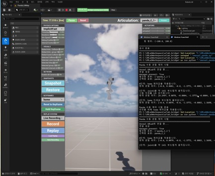
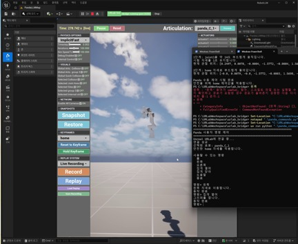
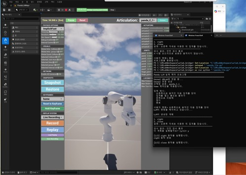
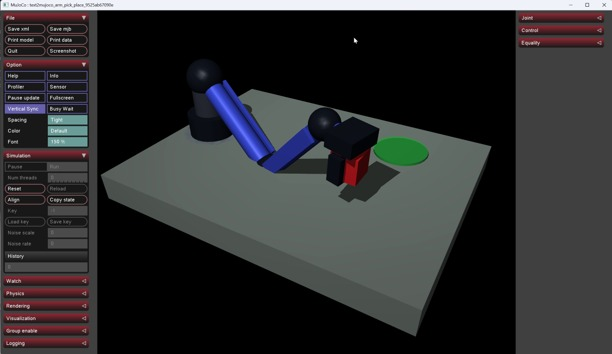
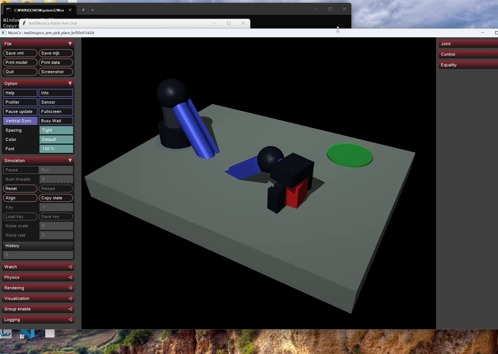

# MuJoCo Robot LLM

**자연어를 제한된 데이터 구조로 해석하고, 규칙 기반 제어기를 통해 시뮬레이션 로봇을 움직이는 연구.**

[영상](#영상과-설명) · [연구 질문](#연구-질문과-목표) · [구현](#구현-과정) · [결과](#결과와-분석) · [재현](#재현과-자료-안내) · [상세 연구 기록](RESEARCH_REPORT.md) · [전체 원본 안내](DATA_AND_RESTORE.md)

## 프로젝트 개요

두 실험 계열을 함께 보존했다. 하나는 **독립 MuJoCo의 장면 생성·집기/놓기**, 다른 하나는 **Unreal Engine 5.7 + Unreal Robotics Lab + Panda + Python/LLM** 제어다.
자연어 해석, 계획 검증, 실제 제어, 물리 실행 결과를 나누어 확인하는 것이 공통 방향이다.

| 항목 | 확인된 내용 |
|---|---|
| 독립 MuJoCo | Pydantic 스키마 → 의미 검증 → 결정론적 MJCF → 4자유도 팔의 IK·상태기계 |
| Unreal Panda | 수동 관절 제어 → 규칙 명령 → 제한된 LLM 계획 → Python 제어 실행 |
| 과거 실행 기록 | 푸셔 5회 + 팔 12회. 팔 중 9회는 위치·제약 보조 없는 성공 기록 |
| 현재 재현 | 2026-09-16 고정 팔 baseline 1회 성공: 5.30초, 2,650 steps, 최종 거리 0.9059mm |
| 검증 범위 | 위 재현은 LLM API·Unreal·전체 테스트·실물 로봇 검증을 포함하지 않음 |
| 엔진 식별 | Unreal + MuJoCo. 폴더의 초기 `unity` 명칭은 Unity 연동의 증거가 아님 |

## 영상과 설명

아래 미리보기는 실제 영상에서 추출했다. 이미지나 제목을 누르면 MP4가 열린다. 각 원본은 기존 Release 링크로 제공한다.

| 영상 | 무엇을 확인할 수 있는가 |
|---|---|
| [](media/previews/robot-manual.mp4)<br>[**Panda · 수동 제어**](media/previews/robot-manual.mp4) · [원본 MP4](https://github.com/YuSihyeon/MuJoCoRobotLLM/releases/download/research-media-2026-09-16/robot-manual.mp4) | **13.93초.** Unreal RobotLLM 화면과 Python 콘솔에서 관절·그리퍼 조작을 확인한다. |
| [](media/previews/robot-command.mp4)<br>[**Panda · 명령 제어**](media/previews/robot-command.mp4) · [원본 MP4](https://github.com/YuSihyeon/MuJoCoRobotLLM/releases/download/research-media-2026-09-16/robot-command.mp4) | **37.30초.** 정해진 명령으로 자세를 바꾸는 규칙 기반 제어다. |
| [](media/previews/robot-llm.mp4)<br>[**Panda · LLM 계획 및 실행**](media/previews/robot-llm.mp4) · [원본 MP4](https://github.com/YuSihyeon/MuJoCoRobotLLM/releases/download/research-media-2026-09-16/robot-llm.mp4) | **70.30초.** 초반은 로봇을 움직이지 않는 계획 검사이며 `429 insufficient_quota`와 미지원 명령 거부가 포함된다. 후반의 실제 제어와 구분한다. |
| [](media/previews/mujoco-test1.mp4)<br>[**Text2MuJoCo · 집기와 놓기**](media/previews/mujoco-test1.mp4) · [원본 MP4](https://github.com/YuSihyeon/MuJoCoRobotLLM/releases/download/research-media-2026-09-16/mujoco-test1.mp4) | **18.87초.** 빨간 물체를 목표 영역으로 옮긴다. 영상만으로 assist 사용 여부를 확정할 수 없다. |
| [](media/previews/mujoco-test2.mp4)<br>[**Text2MuJoCo · 채팅 입력과 실행**](media/previews/mujoco-test2.mp4) · [원본 MP4](https://github.com/YuSihyeon/MuJoCoRobotLLM/releases/download/research-media-2026-09-16/mujoco-test2.mp4) | **34.07초.** 채팅 입력 화면과 MuJoCo 동작을 함께 보여주는 추가 보존 영상이다. |

[미디어 목록과 해설](media/README.md)에는 각 영상의 출처와 관찰 범위가 있다.
독립 MuJoCo metrics와 Unreal Panda 영상이 같은 run이라는 근거는 없다. 영상으로 추종 오차·비상 정지 지연·모든 명령의 성공률을 계산하지 않았다.

## 연구 질문과 목표

**“언어 모델의 출력을 검증 가능한 작은 계획으로 제한하면서, 실행 가능한 물리 장면과 로봇 동작으로 연결할 수 있는가?”**를 탐색했다.
독립 MuJoCo 설계는 LLM이 임의 Python/MJCF를 작성하는 대신 스키마의 위치·질량·마찰 등을 반환하도록 한다.
Panda에서는 LLM이 관절각·힘·속도를 직접 만들지 않고, 미리 구현한 동작 이름의 순서를 제안한다.

| 질문 | 구현한 접근 | 연구에서 확인해야 하는 것 |
|---|---|---|
| 요청을 실행 가능한 입력으로 바꿀 수 있는가? | Pydantic 구조화 출력과 의미 검증 | 형식 유효성과 사용자 의미의 일치를 별도 평가 |
| 언어 모델의 역할을 어디까지 둘 것인가? | 장면 spec 또는 최대 5개 동작 계획 생성 | 물리 루프와 자연어 API 호출의 분리 |
| 물체 이동이 실제 접촉으로 일어나는가? | 위치 보조 → 제약 보조 → contact-only 단계 기록 | 보조 플래그·물체 높이·목표 거리·관통 여부 |
| 엔진에 올린 로봇을 단계적으로 제어할 수 있는가? | inspect → 수동 → 명령 → 계획 검사 → 실행 | 이름·범위·버전·통신과 동작을 순서대로 확인 |

당시 명시적 설계는 [푸셔 설계문서](evidence/text2mujoco/docs/superpowers/specs/2026-07-16-text-to-mujoco-push-world-design.md)와 [팔 설계문서](evidence/text2mujoco/docs/superpowers/specs/2026-07-16-robot-arm-pick-place-design.md)에 보존되어 있다.
다른 엔진·로봇·LLM과의 정량 비교 선발 실험이나 범용 작업 계획 성능 평가를 수행했다는 자료는 없다.

## 수행 내용과 기여 범위

| 범위 | 이 연구의 구현·실험 | 외부 기반 또는 주장 경계 |
|---|---|---|
| Text2MuJoCo | 스키마·검증·MJCF 빌더·규칙 제어·채팅 UI·산출물 기록 | MuJoCo solver와 Pydantic, API SDK를 활용 |
| 조작 실험 | 푸셔 조건 변경, 사용자 정의 팔, 보조 조건을 줄인 집기/놓기 | 강화학습 정책의 학습·평가가 아님 |
| Panda 제어 | 사용자 Python 스크립트 7개, 관절 검사·보간·명령·LLM 연결 | URLab bridge·Unreal 플러그인·Menagerie 모델 전체의 독자 개발을 주장하지 않음 |
| 자산·환경 조정 | Panda import 속성 변경, bridge 의존성 변경 상태 보존 | 변경마다 대응하는 원인 로그와 완전 호환성 검증은 없음 |
| 연구 보존 | 17개 과거 run과 현재 baseline·실패 환경·영상의 근거 연결 | 완전한 개발 대화나 모든 과거 시도가 복원된 것은 아님 |

주요 코드: [Text2MuJoCo](evidence/text2mujoco) · [Panda 제어 스크립트](evidence/panda-control) · [Unreal 텍스트 구성](evidence/unreal-project-skeleton).
외부 기반은 [URLab bridge](https://github.com/URLab-Sim/urlab_bridge), [Unreal Robotics Lab](https://github.com/URLab-Sim/UnrealRoboticsLab), [MuJoCo Menagerie](https://github.com/google-deepmind/mujoco_menagerie)다.
보존 당시 확인한 로컬 HEAD는 각각 `c1fb34e`, `567cbd9`, `71f066a`다. 사용자 스크립트 7개는 bridge의 untracked 파일이었다.
RobotLLM 본체와 text2mujoco에는 당시 Git 저장소가 확인되지 않아 수정 시각만으로 전체 개발 순서를 확정하지 않는다.

## 데이터와 선정 과정

이 연구의 주된 입력은 학습 데이터셋이 아니라 **장면 spec, 로봇 자산, 사용자 명령, 실행별 산출물**이다.
17개 보존 run의 metrics·spec·XML·manifest·log를 선별 삭제 없이 유지했지만, 이 묶음이 전체 시도 집합이라는 보장은 없다.

| 자료·도구 | 선택·사용한 이유 | 남는 제한 |
|---|---|---|
| 사용자 정의 4자유도 팔 | 관절이 보이며 구현·조정·시험 가능한 작은 데모 | 산업용 팔 전체의 동역학·제어 검증이 아님 |
| Panda / Menagerie | 알려진 MJCF 자산으로 Unreal articulation 실험 | 실물 Franka 구동 기록은 없음 |
| MuJoCo | 접촉·마찰·중력·actuator와 headless 평가 | 다른 엔진 대비 정확도 비교 없음 |
| Pydantic | 수치 범위·추가 필드·공간/도달성 검사 | 스키마 통과가 요청 의미의 정확성을 보장하지 않음 |
| Unreal 5.7 / URLab | 로봇 표시·MJCF import·원격 제어 서버 | 현재 공개 스켈레톤만으로 완성 맵 복원 불가 |
| OpenAI structured output | `responses.parse(..., text_format=...)`로 계획/장면 반환 | 실제 API 이용 여부를 과거 모든 run에 귀속할 수 없음 |
| 모델 설정 | Panda `gpt-5.4-mini`, text2mujoco 기본 `gpt-5.6` | 보존 코드의 설정명이며 현재 권장 모델·성능 비교 결과가 아님 |

[WorldSceneSpec](evidence/text2mujoco/src/text2mujoco/world_scenes.py)의 지원 범위는 테이블, 한 조작 물체, 정적 소품, `pick_place`다.
box/sphere/cylinder와 색상·질량·마찰·목표·속도 구분을 표현한다. “창고·주방” 이름이 있어도 일반 실내 전체를 생성하는 월드 모델로 해석하지 않는다.
API 키가 없으면 `local-limited` 규칙 경로를 쓴다. 자연어 task_description만으로 LLM이 장면을 생성했다고 판별할 수 없다.

## 구현 과정

### 1. 푸셔로 최소 실행 경로 구성

```text
SceneSpec → validate_scene → MJCFBuilder → PushController
          → MuJoCo 실행 → metrics / manifest / XML / log
```

푸셔는 X/Y slide joint와 position actuator를 사용하며 접근·정렬·밀기·유지·성공/실패를 나눈다. 주소는 body/joint/actuator 이름으로 찾는다.
첫 보존 실행은 `unstable_speed`로 0.112초에 실패했다. 최대 속도 약 4.0616이 당시 임계 4.0을 넘었다.
이후 최대 힘 90→12, overshoot 0.24→0.07, 속도 종료 임계 4→8을 함께 바꿨고 같은 spec의 네 실행은 0.492초에 성공했다.
여러 조건을 동시에 바꿨으므로 특정 변경 하나의 인과 효과로 설명하지 않는다. [spec 차이](evidence/scene-spec-deltas.json)

### 2. 팔·그리퍼·접촉 기반 집기/놓기

팔은 base yaw와 반경–높이 평면의 두 링크 IK, wrist 범위 제한, 양쪽 finger slide joint로 구성했다.
경유점 사이를 `α²(3−2α)`로 보간하고 시간에 따라 상태를 진행한다. [제어기](evidence/text2mujoco/src/text2mujoco/arm_controller.py)

```text
RESET → 물체 위 접근 → 내려가기 → 닫기 → 들어올리기
      → 목표 위 이동 → 놓을 높이로 이동 → 열기 → 후퇴 → SUCCESS
```

| 보존 단계 | run 수 | 조건과 결과 해석 |
|---|---:|---|
| 직접 위치 보조 | 2 | assisted=true, 0.75초, 거리 0. 순수 접촉 파지 성능으로 계산할 수 없음 |
| 제약 보조 | 1 | assisted=false, constraint=true, 3.30초, 거리 25.513mm |
| 접촉 기반 | 9 | 두 보조 모두 false, 5.30 또는 7.00초, 거리 0.715–6.573mm. 같은 spec 반복 포함 |

contact-only로 전환할 때 닫기 0.35→0.7초, 유지 0.45→0.7초, 놓기 안정 0.35→0.55초, 팔 최대 힘 80→140으로 조건이 바뀌었다.
현재 [실행 함수](evidence/text2mujoco/src/text2mujoco/arm_simulation.py)는 위치·제약 보조를 켠 요청을 거부한다. 과거 보조 run을 현재 코드의 동일 조건 baseline으로 합치지 않는다.

### 3. 장면 생성과 채팅 실행

[채팅 앱](evidence/text2mujoco/src/text2mujoco/arm_chat_app.py)은 `generate_world_scene → world_to_arm_scene → headless 실행 → viewer 실행` 순서다.
물리 루프 내부에서 LLM을 호출하지 않으며, 생성 출처를 결과 요약에 표시한다.
마지막 과거 실행에는 “들어올렸다가 다시 그대로 내려놓아”가 저장됐지만 물체 XY=(0.18, −0.12), 목표 XY=(0.22, 0.18)이다.
이는 요청이 제한된 pick-and-place 틀로 변환된 사례이며 “같은 자리”의 의미를 정확히 수행했다는 근거가 아니다. [해당 spec](evidence/historical-runs/20260717_221155_arm_a1545c32/scene_spec.json)

### 4. Unreal Panda의 단계별 연결

| 단계 | 실제 수행 | 확인 경로 |
|---|---|---|
| diffbot | 바퀴 속도·문자열 명령으로 연결과 종료 정지 시험 | [manual_diffbot.py](evidence/panda-control/manual_diffbot.py), [text_diffbot.py](evidence/panda-control/text_diffbot.py) |
| 구조 검사 | manager·버전·articulation·joint·actuator 이름/범위 조회 | [inspect_panda.py](evidence/panda-control/inspect_panda.py) |
| 수동 제어 | `panda_C_1`, actuator 8개, 첫 관절 0.25rad와 home 보간 | [manual_panda.py](evidence/panda-control/manual_panda.py) |
| 규칙 명령 | left/right 첫 관절 −0.35/+0.35rad, gripper 0/255 | [panda_commands.py](evidence/panda-control/panda_commands.py) |
| 계획 검사 | 구조화 계획 생성·검사만 수행, 로봇 연결 없음 | [llm_test.py](evidence/panda-control/llm_test.py) |
| 계획 실행 | 검사·사용자 확인 후 미리 정한 관절 목표를 보간 | [panda_llm.py](evidence/panda-control/panda_llm.py) |

left/right는 고정 관절 자세이며 세계 좌표에서 일정 거리의 좌우 이동을 뜻하지 않는다.
계획은 `home/left/right/open/close/stop/unknown`으로 제한하고, 빈 계획·5개 초과·unknown 포함을 거부한다. 자세 길이와 actuator 범위를 검사한다.
프롬프트의 모든 자연어 금지 규칙이 별도 코드 검사로 구현된 것은 아니다. 실제 보장은 enum·개수·unknown·자세 범위 검사 범위다.

### 5. 통신과 LLM의 역할

```text
자연어 → RobotPlan → 계획 검사·실행 확인 → 고정 자세/그리퍼 목표
       → 약 30Hz 보간 → set_ctrl() / step()
       → TCP 5559 · MessagePack RPC → Unreal URLab / MuJoCo
```

설정은 `tcp://127.0.0.1`, `step_port=5559`, `step_mode="live"`, `mujoco_version_check=True`다.
live 모드에서는 Unreal이 물리를 진행한다. `step(n_steps=1)` 호출과 Python의 30Hz를 MuJoCo 적분 step/주파수로 동일시하지 않는다.
LLM은 카메라나 물리 상태를 읽어 경로를 재계획하지 않는다. 이 시연의 역할은 제한된 순차 동작으로 언어를 해석하는 것이다.

## 결과와 분석

### 과거 기록: 조건별 결과

| 실행 | 조건 | 결과 | 근거 |
|---|---|---|---|
| 015152 | 초기 푸셔 | 실패, unstable_speed, 0.112초 | [metrics](evidence/historical-runs/20260716_015152_e8e8c4de/metrics.json) |
| 015349 | 힘·overshoot·종료 임계 수정 푸셔 | 성공, 0.492초, 거리 67.525mm | [metrics](evidence/historical-runs/20260716_015349_456887a4/metrics.json) |
| 023036 | 위치 보조 팔 | 성공, 0.750초, 거리 0 | [metrics](evidence/historical-runs/20260716_023036_arm_d49f06e0/metrics.json) |
| 024938 | 제약 보조 팔 | 성공, 3.300초, 거리 25.513mm | [metrics](evidence/historical-runs/20260716_024938_arm_c8964d4a/metrics.json) |
| 043519 | contact-only 팔 | 성공, 5.300초, 거리 0.715mm | [metrics](evidence/historical-runs/20260716_043519_arm_18e9bcf8/metrics.json) |
| 054235 | contact-only, 파란 원통·마찰 0.45·선반·느린 이동 | 성공, 7.000초, 거리 6.573mm | [metrics](evidence/historical-runs/20260716_054235_arm_108be4f5/metrics.json) |

[전체 실행 인덱스](evidence/historical-run-index.json)의 17개 중 16개가 success=true지만 이를 실험 설계에 따른 성공률로 제시하지 않는다.
보조 조건과 반복 spec이 섞였고 전체 과거 시도의 완전성도 알 수 없다. 첫 푸셔의 stable 표시는 유한 상태와 작업 실패를 함께 읽어야 한다.

### 2026-09-16 재현: 고정 contact-only baseline 1회

| 조건·지표 | 값 | 의미 |
|---|---|---|
| 환경 | Python 3.13.10 / MuJoCo 3.10.0 | NumPy 2.4.2, Pydantic 2.13.4, OpenAI 2.45.0 |
| 입력 | seed 11, 7cm box, 0.12kg, 마찰 0.8, 정적 소품 없음 | 고정된 테이블 위 과제 |
| 위치·목표 | 물체 (0.18, −0.12, 0.13)m → 목표 (0.22, 0.18, 0.08)m | 성공 목표 반경 0.08m |
| 시간 설정 | timestep 0.002초 / 최대 8.0초 | 적분 조건 |
| 종료 결과 | success=true, 5.30초, 2,650 physics steps | controller SUCCESS, stable 기록 |
| 최종 목표 거리 | 0.9059mm | 이 입력 1회의 결과 |
| 보조 조건 | assisted=false, constraint=false | 위치·제약 파지 보조 없음 |

근거: [입력 spec](evidence/verification/reverified-baseline-20260916/scene_spec.json), [metrics](evidence/verification/reverified-baseline-20260916/metrics.json), [환경·실행 범위](evidence/verification/reverified-baseline-20260916/environment.json).
성공 조건은 controller SUCCESS, 목표 XY 반경, 충분한 들어올림, 테이블 아래 4mm를 넘는 관통의 부재를 검사한다.
최종 속도·장시간 정착·접촉 힘 상한은 현재 성공 기준에 포함되지 않으며, 초기 metrics는 높이 지표가 없어 같은 기준으로 소급 비교하지 않는다.

### 무엇이 확인되었고 무엇이 남았는가

스키마를 거친 장면 구성, 보조 없는 고정 과제의 물리 실행, Unreal Panda의 단계별 제어 경로를 확인했다.
푸셔 manifest의 model_name/input_prompt는 null이고 팔 manifest에는 해당 필드가 없어, 보존 run으로 LLM 모델별 성능을 비교할 수 없다.
LLM 영상 초반의 `right, close` 계획 변환은 계획 검사 증거이며 후반 실제 실행과 별개다. API quota 오류는 성공률 기록에서 감출 항목이 아니다.
현재 재현은 API를 호출하지 않았고 Unreal을 실행하지 않았다. **실물 로봇 작업 성공, 범용 로봇 지능, 장애물 회피, 폐루프 LLM 제어로 확장하지 않는다.**

## 한계와 다음 단계

아래는 보존 코드에서 파악한 문제와 후속 제안이다. 아직 구현·평가를 마친 기능으로 제시하지 않는다.

| 우선순위 | 현재 한계 | 다음 구현·실험 | 평가 기준 |
|---|---|---|---|
| P0 | 입력 루프의 stop은 블로킹 API·순차 이동 중 즉시 처리되지 않음 | 별도 취소 신호와 control loop 중단 검사 | API 대기·각 이동 중 중단 지연과 최종 상태 기록 |
| P0 | 계획의 stop 뒤 continue로 후속 동작 실행 가능 | stop의 계획 종료 의미를 명시 | `[stop, right]` 등에서 후속 제어 전송 여부 검사 |
| P1 | current_pose가 마지막 목표 중심 | qpos 피드백·도달 오차·timeout·재동기화 | 명령/실측 관절 오차와 통신 실패 후 상태 |
| P1 | 시간 기반 IK, 파지 실패·미끄러짐에 재계획 없음 | 접촉·높이·오차 기반 전이와 실패 진단 | 형상·질량·마찰·위치별 반복 결과, 실패 run 전부 보존 |
| P1 | local-limited·목표 fallback이 요청 의미를 바꿀 수 있음 | 미지원 요청 거부와 채택 좌표·변경 이유 표시 | 정답 계획 정확도, unknown 거부율, 의미 오류 유형 |
| P1 | 자세 검증에 유한성 검사 없음 | shape/type/isfinite 검사 추가 | NaN·무한대·범위 경계 입력 거부 |
| P2 | 모델·환경·생성 출처 기록 부족 | commit/hash·lock·API/fallback 출처 저장 | 각 run을 정확한 입력·환경·생성 경로로 추적 |
| P2 | Panda import·플러그인 테스트 상태 미확인 | 속성 차이와 disabled 테스트 원인 조사 | 같은 서버/클라이언트 버전의 연결·엔진 테스트 결과 |

Panda import에는 56개 요소 속성 차이가 있고 두 C++ 테스트가 `.disabled` 상태다. 원인별 오류 로그나 전체 엔진 테스트 통과로 해석하지 않는다.
[import 차이](evidence/panda-import-delta.json)와 [전체 상세 분석](RESEARCH_REPORT.md)에 호환성·home/종료 정책·경로 계획의 제한도 보존했다.

## 재현과 자료 안내

### 독립 MuJoCo 실행

Python **3.12 이상**이 필요하다. 보존본을 별도 작업 위치로 복사한 뒤 해당 저장소 루트에서 시작한다.

```powershell
Set-Location .\evidence\text2mujoco
python --version
python -m venv .venv
.\.venv\Scripts\Activate.ps1
python -m pip install -e ".[dev]"
python -m pytest -q
python -m ruff check .
python -m ruff format --check .
python -m text2mujoco baseline --headless
python -m text2mujoco arm-baseline --headless
```

GUI는 `python -m text2mujoco.arm_chat_app` 또는 [보존 launcher](evidence/text2mujoco/open_robot_arm_chat.ps1)를 사용한다.
키가 없으면 world-scene 생성은 local-limited다. API 사용 시 `OPENAI_API_KEY`와 필요하면 `OPENAI_MODEL`을 로컬 환경에 설정한다.
원래 가상환경은 의존성 누락, URLab의 Python 3.11.15는 Python 3.12 문법 불일치로 실패했다. 이후 설치된 기본 Python 3.13 환경에서 위 baseline만 재현했다.
[첫 점검](evidence/verification/verification-results.json) · [환경 재확인](evidence/verification/recheck-results.json). Python 파일 43개의 구문 분석과 테스트 함수 48개 정적 집계는 전체 테스트 통과를 뜻하지 않는다.

### Unreal Panda 복원

1. 전체 원본의 UE 5.7 맵·Content·URLab 플러그인과 Panda 자산을 작업 복사본으로 준비한다. 공개 스켈레톤은 완성 배포 프로젝트가 아니다.
2. [bridge 의존성](evidence/dependency-snapshots/urlab-bridge-pyproject.toml)을 확인하고 Python 3.11 계열 환경과 서버 MuJoCo 버전을 맞춘다. 버전 검사를 끄는 것을 기본 복원법으로 삼지 않는다.
3. Play 상태에서 `panda_C_1`, actuator 8개, RPC 5559를 확인한다. `inspect_panda.py → manual_panda.py → panda_commands.py` 순서로 실행한다.
4. `llm_test.py`에서 계획만 검사한 후 `panda_llm.py` 실제 제어를 별도로 확인한다. 현재 보존 점검에서는 이 엔진/API 경로를 재실행하지 않았다.

### 공개 근거와 전체 원본의 위치

| 자료 | 공개 검토 경로 | 프로젝트 보존 폴더의 원본 위치 |
|---|---|---|
| 독립 MuJoCo 소스·과거 17개 run | [소스](evidence/text2mujoco), [과거 실행](evidence/historical-runs) | `originals/text2mujoco_session/` |
| 사용자 스크립트·bridge 환경 | [Panda 제어](evidence/panda-control), dependency snapshots | `originals/urlab_bridge/` |
| Unreal 전체 맵·Content·플러그인 | [프로젝트 구성](evidence/unreal-project-skeleton), [93개 Content 인벤토리](evidence/unreal-assets-inventory.json) | `originals/robot_unreal/` |
| Panda·diffbot 모델 | [Panda 차이](evidence/panda-import-delta.json), [diffbot XML](evidence/diffbot-models) | `originals/mujoco_menagerie/`, `originals/robot_assets/` |
| 영상 5개 | 앞부분의 MP4·Release 링크 | `originals/original-videos/` |
| 환경·복사 검증 | [전체 복원 안내](DATA_AND_RESTORE.md) | 컬렉션 `_shared/`, `_control/manifests/`, 프로젝트 `RESTORE.md` |

전체 위치는 `ResearchCollection/03-MuJoCoRobotLLM/`다. Menagerie 보존은 현재 Panda checkout 범위이며 전체 로봇 카탈로그·모든 Git blob의 보존은 아니다.
공개 근거에는 인증값 제거·이메일 삭제·줄바꿈 정규화가 적용된 사본이 있다. [변환 기록](evidence/copy-transformations.json)과 [출처·라이선스](ATTRIBUTION.md)를 따른다.
원래 README는 루트의 [RESEARCH_REPORT.md](RESEARCH_REPORT.md)에 바이트 그대로 보존했다. Git clone만으로 원본 에셋과 실행 환경이 복원되지는 않는다.
현재 C: 로컬 보존·내용 검증과 USB 외부 사본·초기화 후 전체 실행은 별도 상태이며, USB 전송과 초기화 후 복원 실행은 아직 수행하지 않았다.
